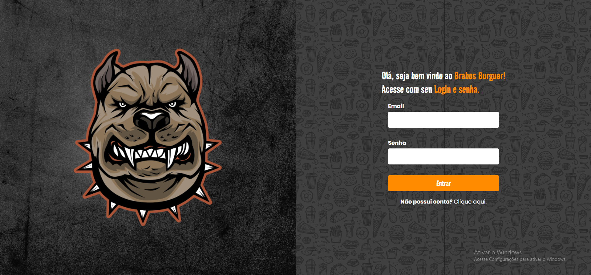
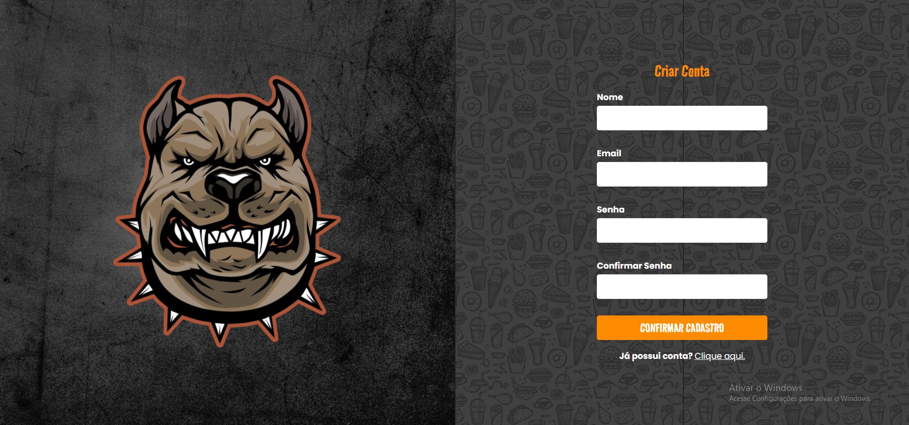
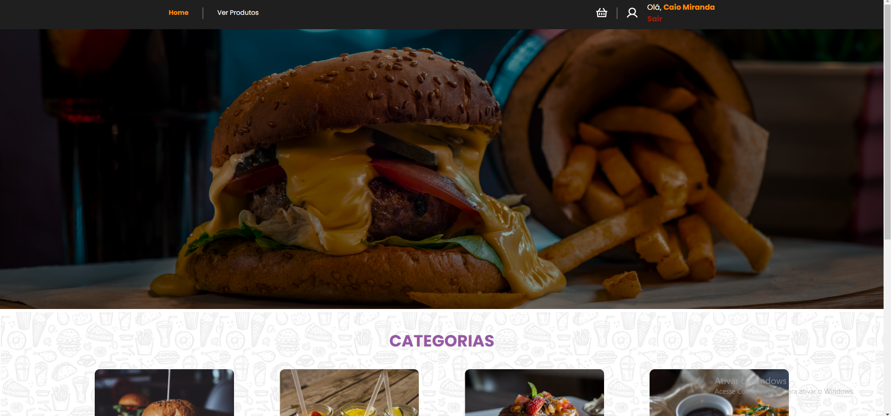
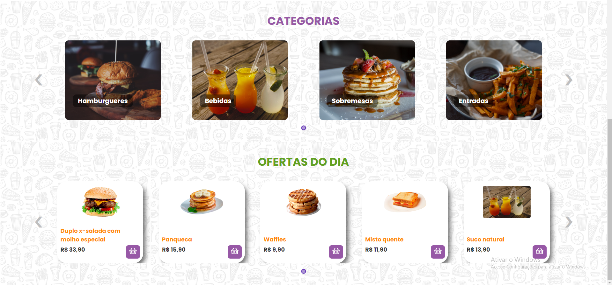
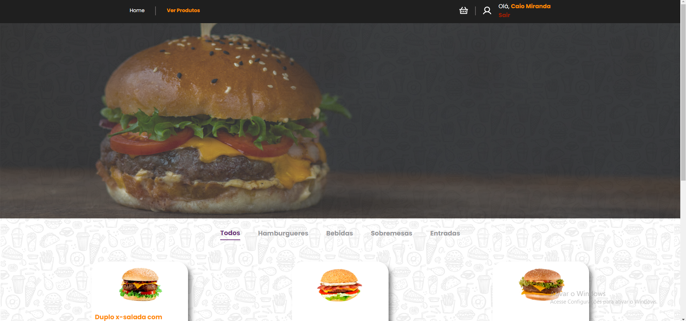
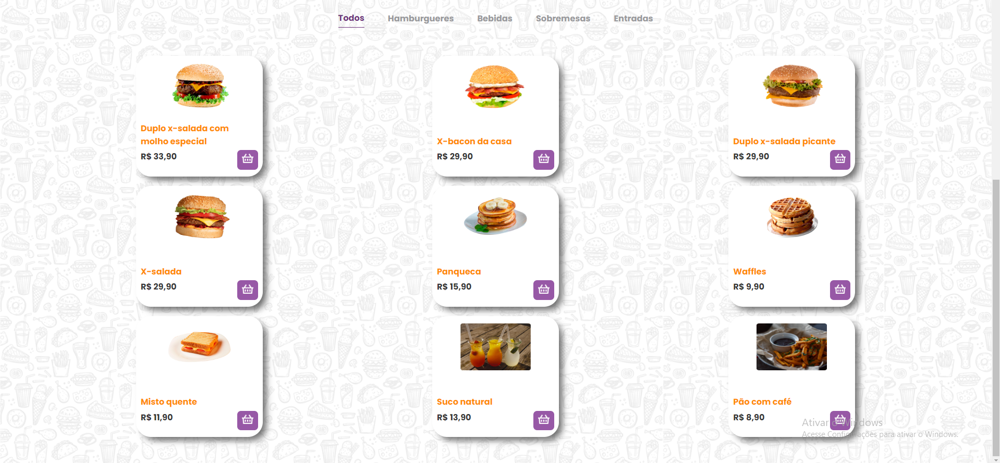
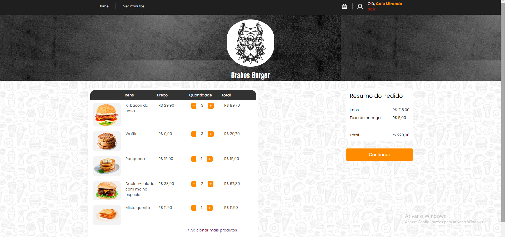

# Brabos Burger - Hamburgueria React + Vite (Front End)

Um website de hamburgueria, com um sistema de login e cadastro intuitivo, organização por categorias para facilitar a escolha dos produtos e uma seção especial destacando as ofertas do dia logo na tela inicial.    Possui também um sistema simples e eficiente que permite aos usuários selecionar a quantidade desejada de cada item e enviá-los diretamente para o carrinho de compras. Com o Brabos Burger, a experiência de pedir hambúrgueres nunca foi tão conveniente e saborosa.

OBS: Além disso, a aplicação é totalmente responsiva para mobile, tablet e desktop

<h2>Tecnologias Utilizadas</h2>

Front end: HTML, CSS, Javascript, React, React hook form, react-elastic-carrousel, react toastify, react-router-dom, styled-components, context api e material ui.

Backend: Node.js, Express, cors, orm, docker, sequelize, mongoose ,bcrypt, jsonwebtoken, multer e yup

Banco de dados: PostgresSQL e MongoDB

<h3>Desktop</h3>

<h3>Mobile</h3>

